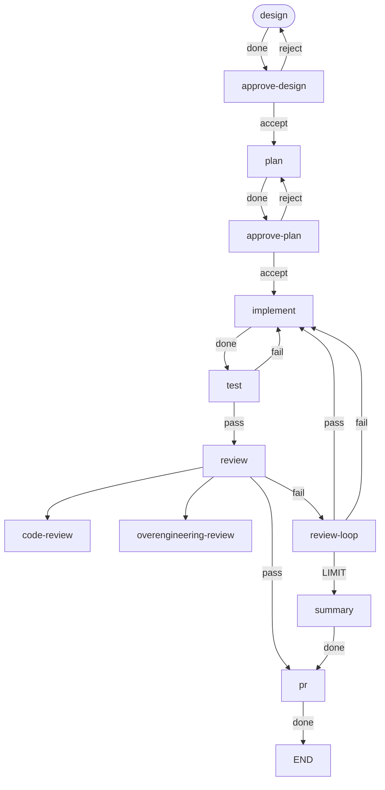

# workgraph

workgraph orchestrates development workflows declared as graphs. Nodes run
agents or commands; a node's outcome selects the transition to follow. The
developer writes the workflow once and starts a run from a harness session
with `/workgraph`. The run prints one progress line per node. One command
resumes a stopped run.

This repository runs its own workflow, `.workgraph/workflows/dev.toml`:



## Install

As a Claude Code plugin:

```
/plugin marketplace add sylmarien/workgraph
/plugin install workgraph@workgraph
```

Installing the plugin adds the `/workgraph` skill and bundles the `dev`
workflow with its agent definitions. The plugin's `install` and `update`
skills finish the setup. Both check that `claude`, `uv`, and `git` are on
`PATH` and install none of them.

Run `install` once, after installing the plugin, and `update` after each
plugin upgrade.

`install` places every missing definition under `~/.workgraph/`, leaves
identical ones alone, and asks before replacing one whose contents differ.
`update` replaces every differing definition, local edits included, behind a
backup. Both install the CLI release from the latest repository tag, which is
independent of the installed plugin version.

Before a replacement, workgraph preserves the destination's bytes in
`<stem>.backup-<sha256><extension>` beside it. A backup is never overwritten
and never deleted by workgraph.

As a Codex plugin:

```sh
codex plugin marketplace add sylmarien/workgraph
codex plugin add workgraph@workgraph
```

Start a new Codex session and invoke `$workgraph dev "#<issue>"`.
The plugin shares the install, update, and run skills, bundled workflow, and
agent definitions with the Claude Code plugin. The `dev` workflow defaults to
the Claude harness, so it requires `claude` and `uv` on `PATH` in Codex too.

Codex reads the repository's existing marketplace at
`.claude-plugin/marketplace.json` and its manifest at
`.codex-plugin/plugin.json`. Both plugins ship in the same Git release.
The patch, minor, and major release workflows update both manifests and
the CLI to the same version. See the
[Codex packaging documentation](https://developers.openai.com/plugins/build/plugins).

Without the plugin:

```sh
uv tool install git+https://github.com/sylmarien/workgraph
```

Requires Python 3.12+. An agent node additionally requires the CLI of its
harness on `PATH`: `claude` for `harness = "claude"`, `codex` for
`harness = "codex"`.

## Example

```sh
workgraph run dev "#12"
```

```
design: done
approve-design: parked
parked at approve-design: Plan from this design? · spent 1m20s · $0.15
Review material from design:
https://github.com/sylmarien/workgraph/issues/12#issuecomment-5550441682
```

```sh
workgraph resume --decision accept
```

```
approve-design: accept
plan: done
approve-plan: parked
parked at approve-plan: Implement this plan? · spent 4m05s · $0.42
Review material from plan:
<the plan>
```

`workgraph resume --decision accept` delivers the decision and resumes the
run.

## Reference

- [Commands](docs/commands.md)
- [Workflow files](docs/workflow-files.md)
- [Agent definitions](docs/agent-definitions.md)

## Development

```sh
uv sync
uv run ruff check && uv run ruff format --check && uv run mypy && uv run pytest
```

The dogfood workflow runs the same gate: `workgraph run dev "#<issue>"`.
