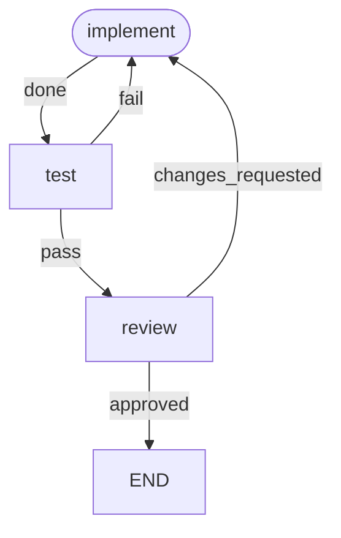

# workgraph

workgraph orchestrates development workflows declared as graphs. Nodes run
agents or commands; a node's outcome selects the transition to follow. The
developer writes the workflow once and starts a run from a harness session
with `/workgraph`. The run prints one progress line per node. One command
resumes a stopped run.

This repository runs its own workflow, `.workgraph/dev.toml`:



## Install

```sh
uv tool install git+https://github.com/sylmarien/workgraph
```

Requires Python 3.12+. Agent nodes additionally require the `claude` CLI on
`PATH`.

## Commands

- `workgraph run <workflow> "<input>"` — run a workflow in the current
  directory. The input is free text, typically an issue ref like `#12`.
- `workgraph resume` — resume the stopped run in the current directory at the
  node where it stopped.
- `workgraph viz <workflow>` — print the workflow graph. `--unicode`
  (default), `--ascii`, or `--mermaid` for the mermaid source.

A run prints one line per node run: `<node>: <outcome>`, or `<node>: failure`.
Exit codes:

- `0` — the run reached `END`.
- `1` — usage error, invalid workflow, a run already in progress, or nothing
  to resume.
- `2` — failure: a node run ended without an outcome. The error names the
  node and the failure kind.
- `3` — escalation: a node hit its visit limit and has no `LIMIT` transition.

After a failure or an escalation, `workgraph resume` restarts the run at the
stopped node. The first re-entry does not count toward the visit limit. A run
that reached `END` cannot be resumed.

## Workflow files

A workflow lives in `.workgraph/<name>.toml`; the filename is the workflow
name. `workgraph` searches the working directory, its parents, then the home
directory, and takes the first match. A project workflow therefore shadows a
personal one of the same name. `.workgraph/dev.toml` in this repository is a
full three-node example; the reference below uses two nodes.

```toml
start = "implement"          # entry node, required

[defaults]                   # per-node settings, overridable on each agent node
harness = "claude"           # only accepted value
model = "sonnet"
effort = "medium"

[nodes.implement]
agent = "implement"          # agent definition name (see below)
outcomes = ["done"]          # closed set; the agent must report one of these

[nodes.implement.limits]
visits = 3                   # max times a run may enter this node

[nodes.implement.transitions]
done = "test"                # every outcome needs a transition
LIMIT = "END"                # taken when the visit limit is reached

[nodes.test]
command = "uv run pytest"    # exit 0 -> pass, anything else -> fail

[nodes.test.transitions]
pass = "END"
fail = "implement"
```

Rules, all validated at load time:

- A node declares exactly one of `agent` or `command`.
- An agent node declares a non-empty `outcomes` list; `harness`, `model`, and
  `effort` must each resolve from the node or `[defaults]`.
- A command node has the fixed outcomes `pass` and `fail`. It declares no
  `outcomes` and no agent settings.
- Transitions are total: every outcome maps to a node name or `END`.
- `END` and `LIMIT` are reserved. `END` as a transition target completes the
  run. A `LIMIT` transition key routes the node when its visit limit is
  reached; without one, reaching the limit stops the run (escalation).
- An agent node may report a free-text handoff with its outcome. workgraph
  appends it to the run input as the next node's prompt, then discards it.
  A command node ignores it.

## Agent definitions

An agent node references an agent definition by name: a Claude Code subagent
file at `.claude/agents/<name>.md` in the working directory or the home
directory, in that order. The file is harness-native and carries no workflow
contract, so the same agent works interactively and inside workflows.

```markdown
---
name: implement
description: Implements a GitHub issue in the current repository.
tools: Bash, Read, Edit, Write, Glob, Grep
---
The run input names a GitHub issue. Read it, implement it, write tests.
```

- The body is the agent's prompt. The run input, plus any handoff, arrives as
  the user message.
- `tools` becomes the spawned agent's `--allowedTools`. Agents run with
  `--permission-mode dontAsk`, so a tool outside the list is denied, not
  prompted for.
- The workflow's `model` and `effort` always apply; frontmatter never
  overrides them.
- workgraph requires the agent to report an outcome from the node's
  `outcomes` via an injected JSON schema. A malformed outcome report is a
  failure, not a misroute.

## The /workgraph skill

Copy this block into `~/.claude/skills/workgraph/SKILL.md` to start and
follow runs from a Claude Code session:

````markdown
---
name: workgraph
description: >
  Start and follow a workgraph run. Use when the user invokes
  /workgraph <workflow> [directory] <input...>.
---
Arguments: the first is the workflow name. If the second names an existing
directory, cd there for the run. Everything remaining is the run input,
passed verbatim as one argument.

1. Launch the run in the background: `workgraph run <workflow> "<input>"`
   (prefixed with `cd <directory> && ` when a directory was given).
2. Relay each progress line (`<node>: <outcome>`) as it appears.
3. On stop, report by exit code:
   - 0: the run reached END.
   - 2 (failure) or 3 (escalation): the stopped node and the error line;
     offer to run `workgraph resume` in the same directory.
   - 1: the error line. Nothing is resumable.
````

There are no per-workflow skills; for a `/dev` shorthand, write a personal
one-line skill that invokes this one with the workflow name filled in.

## Development

```sh
uv sync
uv run ruff check && uv run ruff format --check && uv run mypy && uv run pytest
```

The dogfood workflow runs the same gate: `workgraph run dev "#<issue>"`.
