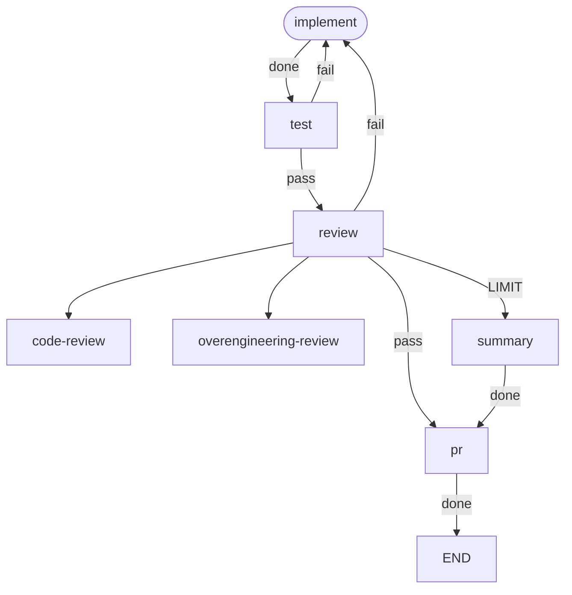

# workgraph

workgraph orchestrates development workflows declared as graphs. Nodes run
agents or commands; a node's outcome selects the transition to follow. The
developer writes the workflow once and starts a run from a harness session
with `/workgraph`. The run prints one progress line per node. One command
resumes a stopped run.

This repository runs its own workflow, `.workgraph/workflows/dev.toml`:



## Install

As a Claude Code plugin:

```
/plugin marketplace add sylmarien/workgraph
/plugin install workgraph@workgraph
```

Installing the plugin adds the `/workgraph` skill and bundles the `dev`
workflow with its agent definitions. The plugin's `install` skill finishes
the setup: it checks that `claude` and `uv` are on `PATH`, installs the CLI
with `uv`, and places the bundled files under `~/.workgraph/`. It installs
neither `claude` nor `uv`.

Without the plugin:

```sh
uv tool install git+https://github.com/sylmarien/workgraph
```

Requires Python 3.12+. Agent nodes additionally require the `claude` CLI on
`PATH`.

## Commands

- `workgraph run <workflow> "<input>"` — run a workflow in the current
  directory. The input is free text, typically an issue ref like `#12`.
- `workgraph resume` — resume the stopped run in the current directory at the
  node where it stopped. `--decision accept|reject` delivers a decision to a
  parked run. `reject` requires `--feedback "<text>"`; `accept` does not
  take it. `--add-time <duration>` grants the run more time (see
  [Time budget](#time-budget)); `--add-cost <usd>` grants it more cost (see
  [Cost budget](#cost-budget)).
- `workgraph status` — report the run in the current directory. Without a
  run: `no run in <dir>` on stderr, exit 1. The first line is one of:
  - the stop line (see below) when the journal ends on a stop;
  - `running <node run> <elapsed>…` with the spent suffix of the stop line
    while the run is in progress; a fanned-out node run reads
    `<map>/<node run>`;
  - `interrupted at <node> · …` when there is no lock file and no stop.

  A stopped or interrupted run then prints:
  - the stop message when the run recorded one;
  - the review material for a parked run;
  - the spent time and each effective time limit;
  - the spent cost and the effective cost limit when the workflow declares
    one.
- `workgraph show-node <node>#<n>` — review one node run of the run in the
  current directory; `<node>` alone names the node's last node run. The
  header lists the start time, the end time and duration (or the running
  time of a node run in progress, or `interrupted` for a node run without
  an end in a run that holds no lock), the cost, and the spent cost. Times
  are local ISO 8601. The sections follow:
  - `input`: the run input and the delivered handoff.
  - `stdout` and `stderr`: the node run output. Agent stdout renders as a
    transcript; `--raw` prints the stream-json lines instead.
  - `outcome`: `<outcome> → <target>`; a map node run lists its children.
  - `handoff`: the emitted handoff.

  Each error prints its message on stderr and exits 1:
  - `no run in <dir>`
  - `no node run of '<node>'`
  - `no node run '<node>#<n>'`

  `--follow` keeps the view current while the run writes. `show-node
  --follow` prints, in order:
  - the name, the start time, and the `input` section;
  - the node run's stdout on stdout and its stderr on stderr, as complete
    lines arrive;
  - the end time, duration, and cost lines, then the `outcome` and
    `handoff` sections, at the node run's end.
- `workgraph show-journal` — list the events of the run in the current
  directory, one line per event, each starting with the local ISO 8601 time:
  - `run: <workflow> "<input>"`
  - `<node run>: started`
  - `<node run>: <outcome> → <target>  <duration>`, then `$<cost>` for an
    agent node run; `<node run>: failure: <message>  <duration>`
  - `<node>: LIMIT → <target>`
  - `<gate>: accept` or `<gate>: reject`, or `resumed`; then `+<time>` and
    `+$<cost>` for the grants
  - the stop line

  A fanned-out node run reads `<map>/<node run>`. A run without a stop ends
  on an untimestamped line: `running <node run> <elapsed>… · spent <t>`
  while the run is in progress, `interrupted at <node> · …` otherwise.
  `--with-nodes` prints a node run's stdout and stderr before its end line,
  the output of every node run in progress before the untimestamped last
  line, and prefixes every line with its origin:
  - `[workgraph#] ` for a journal event
  - `[<node run>] ` for a stdout line
  - `[<node run> stderr] ` for a stderr line

  Agent stdout renders as a transcript unless `--raw`. Without a run:
  `no run in <dir>` on stderr, exit 1.

  `--follow` keeps the view current while the run writes. `show-journal
  --follow` prints, in order:
  - the events so far, without the untimestamped last line;
  - every event as it arrives;
  - the stop line, which ends the follow.

  `--until-end` follows through every stop but `END`:
  - the follow waits at a park or another stop;
  - it prints the resume line when the run resumes;
  - it ends at `END`.

  `--with-nodes --follow` prints the output of every node run in progress
  as it arrives.
- `workgraph viz <workflow>` — print the workflow graph. `--unicode`
  (default), `--ascii`, or `--mermaid` for the mermaid source. The unicode and
  ascii styles widen the diagram to the terminal width. `--theme <name>` picks
  one of termaid's color themes; `--help` lists them.

A follow polls the run record every 0.5 s and never writes to it. For a
stopped run without `--until-end`, or for an ended node run, it prints the
same output as the command without `--follow`. It exits 0 at its end, and
130 on Ctrl-C. Two conditions end it with a message on stderr and exit 1:
- `the run stopped without a stop event`: the run is interrupted.
- `the run was replaced`: the journal shrank or is gone; a new `run` wiped
  the record.

Every subcommand takes `--directory <dir>` ahead of it:
`workgraph --directory <dir> run <workflow> "<input>"`. The flag separates
resolution from execution:

- `workgraph` resolves the workflow TOML and the agent definitions from the
  invocation directory.
- Nodes execute in `<dir>`, and the run record is stored there:
  - `.workgraph/run/state.json`: the run state.
  - `.workgraph/run/journal.jsonl`: the journal, one JSON event per line.
  - `.workgraph/run/<node>#<n>.stdout` and `.stderr`: the output of every
    command and agent node run, `n` counting the node's node runs from 1.

  `run` wipes `.workgraph/run/`; `resume` appends to it.
  `.workgraph/run.lock` exists while the run is in progress.
- `resume` reads the state from `<dir>` and re-resolves the workflow from the
  invocation directory, so a run resumes from the directory it was started
  from.
- `viz` accepts the flag and ignores it: it only resolves files.

Without the flag, both directories are the current directory. `workgraph`
can therefore run one directory's workflows in another directory.

A run prints one line per node run: `<node>: <outcome>`, or `<node>: failure`.
A fanned-out node prints as `<map>/<node>: <outcome>`, in completion order.
The output ends on the stop line:

- `END`, `parked at <gate>: <question>`, `failure at <node>`,
  `escalation at <node>`, `budget at <node>`, or `interrupted at <node>`;
- then ` · spent <t>`;
- then ` · $<c>` when the spent cost is non-zero.

The line is colored on a terminal and plain when piped. Exit codes:

- `0` — the run reached `END`.
- `1` — usage error, invalid workflow, a run already in progress, or nothing
  to resume.
- `2` — failure: a node run ended without an outcome. The error names the
  node and the failure kind.
- `3` — escalation: a node hit its visit limit and has no `LIMIT` transition.
- `4` — park: a gate node waits for a decision. The output is the progress
  line `<gate>: parked`, the stop line with the gate question, then the
  review material.
- `5` — budget stop: the spent time or the spent cost reached a limit of a
  budget. The output is the progress line `<node>: budget` and the stop
  line; the error names the limit.
- `130` — interrupted: Ctrl+C during a node run. The run record keeps the
  node; `resume` enters it.

`workgraph resume` restarts a stopped run; a run that reached `END` cannot
be resumed. What the resume does depends on the stop:

- After a failure, an escalation, or a budget stop, the run enters the
  stopped node.
- After a park, `--decision accept|reject` prints `<gate>: <decision>` and
  follows the matching transition without re-running the gate.

The first entry of every resume is a grace entry: it does not count toward
the visit limit. A run at or past a limit of a budget resumes only with a
grant (`--add-time`, `--add-cost`); otherwise `resume` refuses (exit 1) and
changes nothing.

## Workflow files

A workflow lives in `.workgraph/workflows/<name>.toml`; the filename is the
workflow name. `workgraph` searches the invocation directory, then the home
directory, and takes the first match. A project workflow therefore shadows a
personal one of the same name. `.workgraph/workflows/dev.toml` in this
repository is a full example with three of the four node kinds; the reference
below uses two nodes.

```toml
start = "implement"          # entry node, required

[defaults]                   # per-node settings, overridable on each agent node
harness = "claude"           # only accepted value
model = "sonnet"
effort = "medium"

[nodes.implement]
agent = "implement"          # agent definition name (see below)
outcomes = ["done"]          # closed set; the agent must report one of these

[nodes.implement.limits]
visits = 3                   # max times a run may enter this node

[nodes.implement.transitions]
done = "test"                # every outcome needs a transition
LIMIT = "END"                # taken when the visit limit is reached

[nodes.test]
command = "uv run pytest"    # exit 0 -> pass, anything else -> fail

[nodes.test.transitions]
pass = "END"
fail = "implement"
```

A third node kind fans out:

```toml
[nodes.checks]
map = ["lint", "typecheck"]  # nodes declared in this workflow, run in parallel
resolve = "all"              # pass iff every fanned-out node passes; "any": at least one
```

A fourth node kind parks the run for a human decision:

```toml
[nodes.approve]
gate = "Ship the plan?"      # the question the human is asked

[nodes.approve.transitions]
accept = "build"             # both decisions need a transition
reject = "implement"
```

### Time budget

A workflow may bound the wall-clock time a run spends in node runs:

```toml
[budget]
time_soft = "30m"            # soft limit: stop before the next node
time_hard = 2700             # hard limit: kill the node run in progress
```

- A duration is a bare number of seconds, or a string of a number with the
  unit `s`, `m`, or `h`: `90`, `"90s"`, `"1.5m"`, `"2h"`. It must be positive.
  The same grammar applies to `--add-time`.
- Either key may be absent. `time_hard` must not be below `time_soft`. The
  only other key accepted in `[budget]` is `cost`.
- Spent time is the sum of the wall-clock durations of the run's node runs,
  carried across resumes. A map node's run counts once, as the wall-clock of
  the fan-out. Time while the run is stopped does not count. The run state
  stores it as `spent_time`.
- Soft limit: before entering a node, when the spent time is at or past a
  limit, the run stops with exit 5 and `stopped = "budget"`. The pending
  handoff stays in the state; `workgraph resume --add-time <duration>`
  enters that node as a grace entry.
- Hard limit: workgraph kills a node run when the spent time reaches the
  hard limit; each fanned-out node gets the time left at the start of the
  fan-out. A killed node run is a failure (exit 2,
  `stopped = "failure"`) whose message names the hard limit.
  `resume --add-time <duration>` re-enters it as a grace entry. A
  killed fanned-out node counts as not passing.
- Every failure, escalation, and budget stop stores its message in the run
  state as `reason`; `workgraph status` prints it.
- `workgraph resume --add-time <duration>` grants the run more time. A grant
  raises every declared limit by the amount, accumulates across resumes, and
  is stored in the run state as `added_time`. A grant never creates a limit
  the workflow did not declare. `resume` refuses, and records nothing, when
  the workflow declares no time limit and `--add-time` is passed, or when the
  spent time is still at or past a limit after the grant. Editing the
  workflow file is the other way to raise the budget: `run` and `resume`
  read it on each call.

### Cost budget

A workflow may bound the USD a run spends in agent node runs:

```toml
[budget]
cost = 5.0                   # stop before the next node once 5 USD are spent
```

- `cost` is a positive number of USD. It may appear with or without the time
  keys.
- Spent cost is the sum of the `total_cost_usd` values the harness reports
  for the run's agent node runs, fanned-out nodes included, carried across
  resumes. A command node adds nothing; a result without the field, or with
  a non-numeric one, adds nothing; a failed agent run adds the cost it
  reported. The run state
  stores it as `spent_cost`.
- The harness computes `total_cost_usd` at list API prices. API-key users
  pay that amount; subscription users see an accounting figure.
- Before entering a node, when the spent cost is at or past the limit, the
  run stops with exit 5 and `stopped = "budget"`, like a soft time limit.
  The node run in progress always finishes; there is no mid-node cost check.
  A map fan-out can therefore overshoot the limit by the cost of its
  fanned-out nodes.
- A node run that never ends has no cost bound: declare `time_hard` with
  `cost`; the hard limit stops such a node run.
- `workgraph resume --add-cost <usd>` grants the run more cost. A grant
  raises the limit, accumulates across resumes, and is stored in the run
  state as `added_cost`. `resume` refuses, and records nothing, when the
  workflow declares no `cost` and `--add-cost` is passed, or when the spent
  cost is still at or past the limit after the grant.

Rules, all validated at load time:

- A node declares exactly one of `agent`, `command`, `map`, or `gate`.
- An agent node declares a non-empty `outcomes` list; `harness`, `model`, and
  `effort` must each resolve from the node or `[defaults]`.
- A command node has the fixed outcomes `pass` and `fail`. It declares no
  `outcomes` and no agent settings.
- A map node also has the fixed outcomes `pass` and `fail`, resolved with
  `resolve` over the fanned-out nodes' outcomes. It declares no `outcomes`
  and no agent settings. One fan-out counts as one visit to the map node.
- A fanned-out node must have `pass` among its outcomes and declares no
  `transitions` and no `limits`. It cannot be the start node, a transition
  target, a map node, or fanned out twice. Its failure counts as not
  passing and never stops the run.
- Fanned-out handoffs concatenate in `map` order, each block prefixed with
  its node's name; the successor sees the map node as the handoff source.
  A handoff delivered to the map node is forwarded to every fanned-out node.
- A gate node has the fixed outcomes `accept` and `reject`. `gate` is a
  non-empty question. It declares no `outcomes`, `limits`, or agent settings,
  and cannot be fanned out. It may be a `LIMIT` transition target.
- Reaching a gate parks the run (exit 4) with the pending handoff as the
  review material. `accept` forwards that handoff to the target unchanged.
  `reject` delivers a handoff from the gate whose text is JSON:
  `{"received": <pending handoff text or null>, "feedback": "<text>"}`.
  The entry either decision causes is a grace entry.
- Transitions are total: every outcome maps to a node name or `END`.
- `END` and `LIMIT` are reserved. `END` as a transition target completes the
  run. A `LIMIT` transition key routes the node when its visit limit is
  reached; without one, reaching the limit stops the run (escalation).
- `limits.reset` names an outcome; a node run ending with it returns the
  node's visit count to zero, so `visits` bounds entries since the last
  reset. `reset` requires `visits` and must be one of the node's outcomes.
- An agent node may report a free-text handoff with its outcome. workgraph
  appends it to the run input as the next node's prompt, then discards it.
  A command node, or a map node whose fanned-out nodes report none, forwards
  it unchanged, with its original source, to its own successor.

## Agent definitions

An agent node references an agent definition by name: a file in the Claude
Code subagent format at `.workgraph/agents/<name>.md` in the invocation
directory or the home directory, in that order. The file carries no workflow
contract.

```markdown
---
name: implement
description: Implements a GitHub issue in the current repository.
tools: Bash, Read, Edit, Write, Glob, Grep
---
The run input names a GitHub issue. Read it, implement it, write tests.
```

- The body is the agent's prompt. The run input, plus any handoff, arrives as
  the user message.
- `tools` becomes the spawned agent's `--allowedTools`. Agents run with
  `--permission-mode dontAsk`, so a tool outside the list is denied, not
  prompted for.
- The workflow's `model` and `effort` always apply; frontmatter never
  overrides them.
- workgraph requires the agent to report an outcome from the node's
  `outcomes` via an injected JSON schema. A malformed outcome report is a
  failure, not a misroute.

## The /workgraph skill

The plugin ships this skill. Without the plugin, copy this block into
`~/.claude/skills/workgraph/SKILL.md` to start and follow runs from a
Claude Code session:

````markdown
---
name: workgraph
description: >
  Start and follow a workgraph run. Use when the user invokes
  /workgraph <workflow> [directory] <input...>.
---
Arguments: the first is the workflow name. If the second names an existing
directory, pass it as `--directory`. Everything remaining is the run input,
passed verbatim as one argument.

1. Launch the run in the background:
   `workgraph run <workflow> "<input>"`, with
   `--directory <directory>` before `run` when a directory was given.
   Never cd: `--directory` keeps workflow and agent file resolution in the
   session's directory while the run executes in the target.
2. Relay each progress line (`<node>: <outcome>`) as it appears.
3. On stop, report by exit code:
   - 0: the run reached END.
   - 2 (failure) or 3 (escalation): the stopped node and the error line;
     offer to run `workgraph resume` with the same `--directory`.
   - 4 (park): the gate question and the review material; ask the user for
     a decision, then run `workgraph resume --decision accept` or
     `workgraph resume --decision reject --feedback "<text>"` with the same
     `--directory`.
   - 1: the error line. Nothing is resumable.
````

There are no per-workflow skills; for a `/dev` shorthand, write a personal
one-line skill that invokes this one with the workflow name filled in.

## Development

```sh
uv sync
uv run ruff check && uv run ruff format --check && uv run mypy && uv run pytest
```

The dogfood workflow runs the same gate: `workgraph run dev "#<issue>"`.
