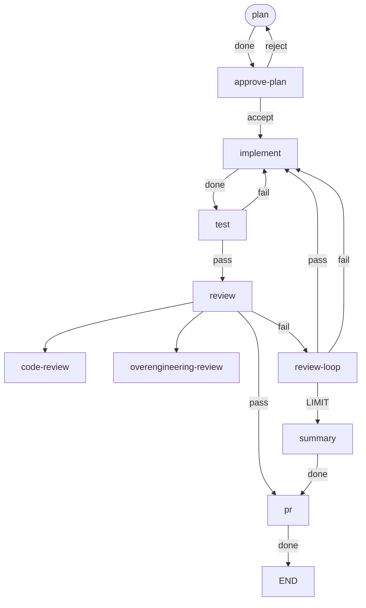

# workgraph

workgraph orchestrates development workflows declared as graphs. Nodes run
agents or commands; a node's outcome selects the transition to follow. The
developer writes the workflow once and starts a run from a harness session
with `/workgraph`. The run prints one progress line per node. One command
resumes a stopped run.

This repository runs its own workflow, `.workgraph/workflows/dev.toml`:



## Install

As a Claude Code plugin:

```
/plugin marketplace add sylmarien/workgraph
/plugin install workgraph@workgraph
```

Installing the plugin adds the `/workgraph` skill and bundles the `dev`
workflow with its agent definitions. The plugin's `install` skill finishes
the setup: it checks that `claude` and `uv` are on `PATH`, installs the CLI
with `uv`, and places the bundled files under `~/.workgraph/`. It installs
neither `claude` nor `uv`.

Without the plugin:

```sh
uv tool install git+https://github.com/sylmarien/workgraph
```

Requires Python 3.12+. An agent node additionally requires the CLI of its
harness on `PATH`: `claude` for `harness = "claude"`, `codex` for
`harness = "codex"`.

## Example

```sh
workgraph run dev "#12"
```

```
plan: done
approve-plan: parked
parked at approve-plan: Implement this plan? · spent 4m05s · $0.42
Review material from plan:
<the plan>
```

`workgraph resume --decision accept` delivers the decision and resumes the
run.

## Reference

- [Commands](docs/commands.md)
- [Workflow files](docs/workflow-files.md)
- [Agent definitions](docs/agent-definitions.md)

## Development

```sh
uv sync
uv run ruff check && uv run ruff format --check && uv run mypy && uv run pytest
```

The dogfood workflow runs the same gate: `workgraph run dev "#<issue>"`.
